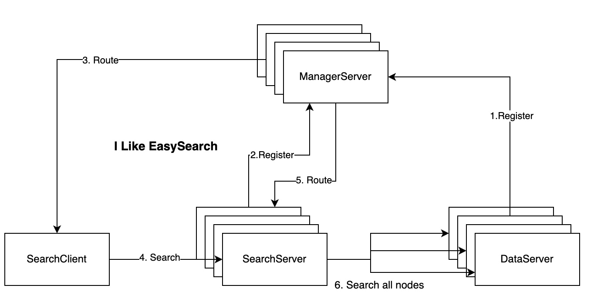

# Easy Full-Text Search Engine

# Overview
EasySearch是一个分布式的全文检索搜索引擎，同时支持内存检索与磁盘检索，并针对性做了性能优化。

## 新特性

1. 支持基于wiki文档构建倒排索引
2. 索引结构支持Hashtable与Btree
3. 引擎支持全量索引+增量索引，增量索引是基于Hashtable在内存中构建的，支持实时更新，定时合并到全量索引；且支持了DoubleBuffer更新，提升了查询性能；
4. 全量索引分为SmallSegment、MiddleSegment、BigSegment 3中， 多个SmallSegment达到一定大小后合并到MiddleSegment，以此类推。按不同大小或时间拆分，也可以降低全量索引重建成本
5. 检索加速：支持非精准topk检索，postinglist归并时，支持按词频等静态分提前截断r个加速归并（胜者）。 归并后支持截断
6. 相关性打分：支持bm25相关性排序
7. 支持搜索词语义改写

## Requirement
- go 1.16.5 以上


## Quick Start
### 下载

- 下载项目代码到你的工作目录：

  ```
  git clone https://github.com/awesomefly/easysearch.git
  ```

- 通过go mod更新依赖:

  ```
  cd $PROJECT_DIR
  go mod tidy
  ```

- 项目构建:
  ```
  go build
  ```

### 本地索引
- 下载wiki文档到本地路径, 这里我们下载wiki摘要数据，对摘要建立倒排索引。 [下载链接]( https://dumps.wikimedia.org/enwiki/latest/enwiki-latest-abstract1.xml.gz)
  ```
  cd $PROJECT_DIR/data
  wget  https://dumps.wikimedia.org/enwiki/latest/enwiki-latest-abstract1.xml.gz
  ```
- 构建索引文件， 在项目路径下创建config.yml文件，加入构建索引配置项
    ```
  cd $PROJECT_DIR
  vim config.yml
  ```
  - 配置如下：
  ``` 
  Storage:
    IndexFile: ./data/wiki_index   #索引文件存储路径
    DumpFile: ./data/enwiki-latest-abstract1.xml.gz  #文档路径
  BM25:
    K1: 2
    B: 0.75 
  ```
  - 创建索引
  ```
  cd $PROJECT_DIR
  ./easysearch -m indexer
  ```
  如果索引构建成功，$PROJECT_DIR/data目录下会生成 wiki_index.idx,wiki_index.kv,wiki_index.sum 三个文件
- 本地检索, 通过关键字搜索文档
  ```
  ./easysearch -m searcher -q "Album Jordan" --source=local
  ```

### 语义改写 [参考](https://github.com/dwt0317/QueryRewritingService/tree/master/embedding)
- requirement
  - python 3.8+
- 下载训练集 [下载链接](https://dumps.wikimedia.org/enwiki/latest/enwiki-latest-pages-articles.xml.bz2)
  ```
  cd $PROJECT_DIR/data
  wget https://dumps.wikimedia.org/enwiki/latest/enwiki-latest-pages-articles.xml.bz2
  ```
- 文本预处理：wiki文档预处理，提取词集到data/wiki_texts.txt
  ```
  /usr/bin/python3 paraphrase/train/wiki2txt.py --cmd=parse --file=$WIKI_FILE
  ```
- 模型训练: 采用python gensim.word2vec训练数据，并保存模型与词向量集合 
  ```
  /usr/bin/python3 paraphrase/train/word2vec.py --cmd=train --corpus_file=./data/wiki_texts.txt 
  ```
  训练成功则会生成：

  模型数据文件./data/med200_less.model.bin

  向量数据文件 ./data/word2vec.format.bin
- 模型应用
  - golang语言可以使用code.sajari.com/word2vec库来加载训练得到的词向量集合， 通过并通过接口获取搜索词的近义词
  - 单元测试 paraphrase/serving/model_test.go
  - 本地搜索时需要增加选项 --model_file
    ```
    ./easysearch -m searcher -q "Album Jordan" --source=local --model_file=./data/word2vec.format.bin 
    ```
  - 集群搜索时新增配置项
    ``` 
    Storage:
      IndexFile: ./data/wiki_index   #索引文件存储路径
      DumpFile: ./data/enwiki-latest-abstract1.xml.gz  #文档路径
      ModelFile: ./data/word2vec.format.bin
    ```

### 分布式

#### Architecture
 
- MangerServer 服务信息与元数据管理节点
- DataServer 索引数据存储节点， 每个节点上有多个分片索引数据
- SearchServer 只负责处理查询请求


#### 构建分片索引
- 修改配置
  ```
  cd $PROJECT_DIR
  vim config.yml
  ```
- 新增分片配置如下：
  ``` 
  Storage:
    IndexFile: ./data/wiki_index   #索引文件存储路径
    DumpFile: ./data/enwiki-latest-abstract1.xml.gz  #文档路径
  BM25:
    K1: 2
    B: 0.75 
  Cluster:
    ShardingNum: 10

  ```
- 创建索引分片
  ```
  cd $PROJECT_DIR
  ./easysearch -m indexer --sharding=true

  ```
#### 创建集群

###### 创建单机standalone集群

  - 创建集群配置文件（cluster.yml只用与创建Standalone集群）
      ```
      cd $PROJECT_DIR
      vim cluster.yml
      ```
  - 配置（创建1个管理节点，10个数据节点，2个查询节点）
      ```
      ManageServer:
        Host: 127.0.0.1
        Port: 1234
      SearchServer:
        - Host: 127.0.0.1
          Port: 1235
        - Host: 127.0.0.1
          Port: 1236
      DataServer:
        - Host: 127.0.0.1
          Port: 1240
        - Host: 127.0.0.1
          Port: 1241
        - Host: 127.0.0.1
          Port: 1242
        - Host: 127.0.0.1
          Port: 1243
        - Host: 127.0.0.1
          Port: 1244
        - Host: 127.0.0.1
          Port: 1245
        - Host: 127.0.0.1
          Port: 1246
        - Host: 127.0.0.1
          Port: 1247
        - Host: 127.0.0.1
          Port: 1248
        - Host: 127.0.0.1
          Port: 1249
      ```
  - 修改config.yml配置如下
      ``` 
      Storage:
        IndexFile: ./data/wiki_index   #索引文件存储路径
        DumpFile: ./data/enwiki-latest-abstract1.xml.gz  #文档路径
      BM25:
        K1: 2
        B: 0.75
      Cluster:
        ShardingNum: 10
        ManageServer:  #ip port保持与集群配置一致
          Host: 127.0.0.1
          Port: 1234
      ```
  - 集群启动
      ```
      bash start.sh standalone
      ```
###### 创建分布式集群
  - 自行创建集群需要准备好机器实例，分别在不同机器节点上启动不同服务
  - 启动顺序 ManagerServer->DataServer->SearchServer
  - 启动ManagerServer
    - 配置如下
    ``` 
    Server: # ManagerServer host和ip
      Host: 127.0.0.1
      Port: 1234
    Cluster:
      ShardingNum: 10
      ReplicateNum: 3
    ```
    - 启动
    ```
    ./easysearch -m cluster --servername=managerserver
    ```
    
  - 启动DataServer
    - 配置
    ```
    Storage:
      IndexFile: ./data/wiki_index   #索引文件存储路径
      DumpFile: ./data/enwiki-latest-abstract1.xml.gz  #文档路径
    BM25:
      K1: 2
      B: 0.75
    Server: # DataServer host和ip
      Host: 127.0.0.1
      Port: 1240   
    Cluster:
      ShardingNum: 10
      ReplicateNum: 3
      ManageServer:  #ManagerServer ip port保持与集群配置一致
        Host: 127.0.0.1
        Port: 1234
    ```
    - 启动
    ```
    ./easysearch -m cluster --servername=dataserver
    ```
    - 启动SearchServer
      - 配置
      ```
      Server: # SearchServer host和ip
        Host: 127.0.0.1
        Port: 1235 
      Cluster:
        ShardingNum: 10
        ReplicateNum: 3
        ManageServer:  #ManagerServer ip port保持与集群配置一致
          Host: 127.0.0.1
          Port: 1234
      ```
      - 启动
      ```
      ./easysearch -m cluster --servername=searchserver
      ```      
#### 分布式检索
    
- 结果查询
  ```
  ./easysearch -m searcher -q "Album Jordan" --source=remote
  ```
- OUPUT:
    ```
    2021/12/20 19:45:03 Starting remote search..
    2021/12/20 19:45:04 Search found 5 documents in 611.645503ms
    2021/12/20 19:45:04 10  The Great Session is an album led by pianist Duke Jordan recorded in 1978 and released on the Danish SteepleChase label in 1981.Duke Jordan discography, accessed March 24, 2015SteepleChase Records discography, accessed March 24, 2015
    2021/12/20 19:45:04 605 Thinking of You is an album led by pianist Duke Jordan recorded in 1979 in Denmark (with one track from 1978) and released on the Danish SteepleChase label in 1982.Duke Jordan discography, accessed March 24, 2015SteepleChase Records discography, accessed March 24, 2015
    2021/12/20 19:45:04 613 Change a Pace is an album led by pianist Duke Jordan recorded in 1979 in Denmark and released on the Danish SteepleChase label in 1980.Duke Jordan discography, accessed March 24, 2015SteepleChase Records discography, accessed March 24, 2015
    2021/12/20 19:45:04 597 Flight to Japan is an album led by the pianist Duke Jordan, recorded in 1976 in Tokyo and released on the Danish SteepleChase label in 1978.Duke Jordan discography, accessed March 24, 2015- SteepleChase Records discography, accessed March 24, 2015
    2021/12/20 19:45:04 564 Suburbs is an album by the American New wave band The Suburbs, released in 1986. It was their first and only release on A&M Records.
  
    ```


## TODO
- PostingList压缩与归并效率优化
- 字典索引压缩，减少存储空间
- 精排引入LR、DNN
- 多路召回引入向量检索

## 参考

- [skip-list vs btree](https://stackoverflow.com/questions/256511/skip-list-vs-binary-search-tree/28270537#28270537)
- [simple fts](https://artem.krylysov.com/blog/2020/07/28/lets-build-a-full-text-search-engine/.)


